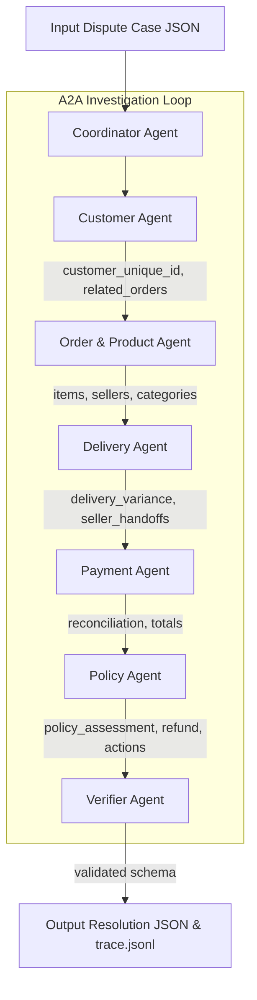

# Multi-Agent Architecture — E-commerce Dispute Resolution (A2A)

System architecture documentation for Day 9 Multi-Agent E-commerce Dispute Resolution Lab.

## 1. Overview & Multi-Agent Design

The system implements a decentralized, role-specialized **Agent-to-Agent (A2A)** architecture. Rather than relying on a single monolithic prompt, seven specialized agents perform localized investigations on specific domain data, handing off evidence and findings step-by-step to reach a verifiable resolution under `EC_POLICY_V2`.

---

## 2. Agent Roles, Permissions & Access Matrix

| Agent Name | Primary Responsibility | Data Access Permissions | Output Artifact / Handoff Payload |
| :--- | :--- | :--- | :--- |
| **CoordinatorAgent** | Case delegation, workflow orchestration, final synthesis. | `input/EC_*.json` | Task dispatch & final resolution output |
| **CustomerAgent** | Customer identity lookup, repeat purchase history. | `olist_customers`, `olist_orders` | `customer_unique_id`, `related_order_ids` |
| **OrderProductAgent** | Item, product, seller, and category resolution. | `order_items`, `products`, `sellers`, `translation` | `item_ids`, `seller_ids`, `product_ids`, `category_names` |
| **DeliveryAgent** | Shipping limits, carrier handoff & delivery variance analysis. | `orders`, `order_items` | `delivery_variance_hours`, `seller_handoff_analysis` |
| **PaymentAgent** | Summation of payment rows, calculation of total vs expected. | `order_payments`, `order_items` | `expected_total_brl`, `difference_brl`, `reconciled` |
| **PolicyAgent** | Deterministic evaluation of `EC_POLICY_V2` rules. | `EC_POLICY_V2` rules engine | `primary_issue`, `secondary_issues`, `refund`, `actions` |
| **VerifierAgent** | Schema integrity, array bounds, null safety, evidence check. | Full output JSON payload | Pass/Fail validation flag |

---

## 3. Data Flow & Handoff Sequence

1. **Case Ingestion**: `CoordinatorAgent` receives the case specification (e.g. `EC_001.json`) containing the `claimed_order_id`.
2. **Customer Profiling**: `CustomerAgent` queries `customer_unique_id` to identify any previous or related orders (`related_order_ids`).
3. **Item & Seller Extraction**: `OrderProductAgent` retrieves all item lines, seller IDs, product IDs, and maps product categories to English.
4. **Logistics & Handoff Audit**: `DeliveryAgent` calculates:
   - $delivery\_variance\_hours = order\_delivered\_customer\_date - order\_estimated\_delivery\_date$
   - $handoff\_variance\_hours = order\_delivered\_carrier\_date - shipping\_limit\_date$
5. **Financial Reconciliation**: `PaymentAgent` calculates total payments against item price + freight sums, evaluating the $\pm 0.10$ BRL tolerance threshold.
6. **Policy Decision**: `PolicyAgent` evaluates `EC_POLICY_V2` rules in priority order to assign primary issue, secondary issues, root cause, responsible party, refund, and resolution actions.
7. **Verification & Audit Trace**: `VerifierAgent` validates all array limits ($\le 5$ orders, $\le 5$ items, $\le 3$ sellers, $\le 20$ evidence IDs), logs the trace to `trace.jsonl`, and writes the output file.

---

## 4. EC_POLICY_V2 Compliance Rules

- **Priority Hierarchy**:
  1. `canceled_order_paid` $\rightarrow$ Refund full payment (Responsible: `platform`)
  2. `unavailable_order_paid` $\rightarrow$ Refund full payment (Responsible: `platform`)
  3. `late_delivery_seller` $\rightarrow$ Refund freight (Responsible: `seller`)
  4. `late_delivery_logistics` $\rightarrow$ Refund freight (Responsible: `logistics_provider`)
  5. `valid_split_payment` $\rightarrow$ Refund 0 BRL (No responsible party)
  6. `unsupported_late_claim` $\rightarrow$ Refund 0 BRL (No responsible party)

- **Secondary Issues (In Mandated Order)**:
  1. `multi_item_order`
  2. `multi_seller_order`
  3. `split_payment`
  4. `repeat_customer`
  5. `multiple_categories`
